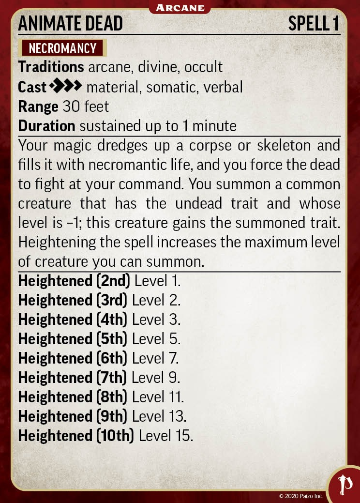
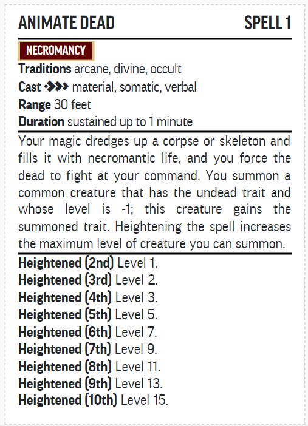

# pf2easy-spell-cards

## What
This is a little project to improve the functionality that already exists on the pf2 easy website, regarding the Spellbook and Sheets features.
If you execute the code, it changes the layout from the multi column layout, to a playing card layout, styled (minimalisticly) like the official Paizo Spell cards.

## How
### 1. One time insert
If you use the one-time-insert, you have to copy-paste the javascript code into your browser's console, and the styling will be automatically added. Next you can slightly edit the cards with the extra functions listed below. Finally you can print the cards on an A4 to cut them and use them in your games.

### 2. Use a browser extension to automatically execute the code for multiple use.
Extensions like User Javascript and CSS on Chrome or Code Injector on Firefox, will allow you to automatically add the code to the website every time that u use it. Don't forget to enable jQuery, because it is used in the javascript code.
This works essentially in the same way as the one time insert, except that you will see a button with cards to click when you want to use this functionality on your spells.

### Extra functions
There are essentially 3 functions to use on a card:

1. Click: Change the description font size.
This goes from normal -> small -> smaller -> bigger -> big -> normal.

2. Ctrl + Click: Split the card in a front and back.
Click once to make the back card appear, and keep clicking to add more paragraphs.
Click on the backside of the card to put the last paragraph back on the front card.

3. Alt + Click: Change default description to api description.
Sometimes, the description is not complete with heightened information.
You can switch between the default and an (experimental) one, that might improve the card.
This is not yet finished and doesn't always give good results (parsing errors)

These functions can be used together to create the best cards for your use.

You can also change the border radius of the cards with the slider next to this link.

## Why
I've only recently started with playing Pathfinder 2e (or DnD in general for that matter), and am only starting to learn the system very slowly. I play a cleric, so I need to be able to go through a lot of spells quickly and wanted to try out spell cards.
I looked around for a while but noticed there weren't really good tools to recreate the official Paizo spell cards which I had seen in a video online. I did notice however that the pf2 easy website already had a very similar look to the official Paizo merchandise, so decided to give it a shot.

I initially only did it once to try it out, and posted a response on a Reddit thread, to share my result, and after I got a few positive replies, decided to expand the functions and to try to get as close as possible to the official cards. 

There are still some things that could improve, and I would like to add a recto verso option, but that's something for later.

## Results
  |  