# pf2easy-spell-cards

## What
This is a little project to improve the functionality that already exists on the pf2 easy website, regarding the [Spellbook](https://pf2easy.com/spellbook/) and [Sheets](https://pf2easy.com/sheets/) features.
If you execute the code, it changes the layout from the multi column layout, to a playing card layout, styled (minimalisticly) like the official Paizo Spell cards.

## How
### 1. One time insert
If you use the one-time-insert, you have to copy-paste the javascript code below into your browser's console, and the styling will be automatically added. Next you can slightly edit the cards with the extra functions listed below. Finally you can print the cards on an A4 to cut them and use them in your games.

```console
var script = document.createElement('script'); script.src = "https://cdn.jsdelivr.net/gh/arthurvanpassel/pf2easy-spell-cards@latest/one-time-insert.js"; document.querySelector('head').appendChild(script);
```

### 2. Use a browser extension to automatically execute the code for multiple use.
Extensions like [User Javascript and CSS on Chrome]() or [Code Injector on Firefox](https://addons.mozilla.org/en-US/firefox/addon/codeinjector/), will allow you to automatically add the code to the website every time that u use it. Don't forget to enable jQuery, because it is used in the javascript code.
This works essentially in the same way as the one time insert, except that you will see a button with cards to click when you want to use this functionality on your spells.

If you need a regex (like in Code Injector for example), you can use this regex: pf2easy\\.com\\/(spellbook|sheets)\\/spells.php

### Extra functions
There are essentially 3 functions to use on a card:

1. Slider: Change the description font size.
This goes from smallest -> small -> normal (default) -> big -> bigger.

2. Ctrl + Click: Split the card in a front and back.
Click once to make the back card appear, and keep clicking to add more paragraphs.
Click on the backside of the card to put the last paragraph back on the front card.

3. Alt + Click: Change default description to api description.
Sometimes, the description is not complete with heightened information.
You can switch between the default and an (experimental) one, that might improve the card.
This is not yet finished and doesn't always give good results (parsing errors) (see in progress below).

These functions can be used together to create the best cards for your use.

You can also change the border radius of the cards with the slider next to this link.

You can also remove the source from the cards, since they don't appear on the official ones either.


## Why
I've only recently started with playing Pathfinder 2e (or DnD in general for that matter), and am only starting to learn the system very slowly. I play a cleric, so I need to be able to go through a lot of spells quickly and wanted to try out spell cards.
I looked around for a while but noticed there weren't really good tools to recreate the official Paizo spell cards which I had seen in a video online. I did notice however that the pf2 easy website already had a very similar look to the official Paizo merchandise, so decided to give it a shot.

I initially only did it once to try it out, and posted [a response on a Reddit thread](https://www.reddit.com/r/Pathfinder2e/comments/f0rl1g/comment/hwffod7), to share my result, and after I got a few positive replies, decided to expand the functions and to try to get as close as possible to the official cards. 

## Conclusion
If you have any questions or suggestions, don't hesitate to hit me up! I made this thing in a pretty short time period, with a specific vision in mind, but I think it can still be improved! 

### Still in progress or coming in the future

- I still realy want to add a recto verso option, so you don't have to glue the front and back together, but don't really know how to properly display that in the browser so it doesn't look too complicated.

- The Alt - Click functionality is dependant on an api which still needs some improvements as well. I hope the parsing issues can be fixed, and then the cards will be even better!
  - UPDATE: I've improved the api list! I've made a separate script which needs to be run on the Archives of Nethys to get the feat and spell data, and replace all the markdown with my own code! I could only get it to work on AoN because the elasticsearch endpoints are protected and can not be accessed from pf2easy..., maybe I can find a better way in the future (there is also the free accessible data on [the github from foundry](https://github.com/foundryvtt/pf2e/tree/master/packs/spells), but they differ slightly and don't use markdown)

### Next steps
I am going to send this to Pf2 easy and maybe if they're interested, they can put it on their website! 

## Screenshots
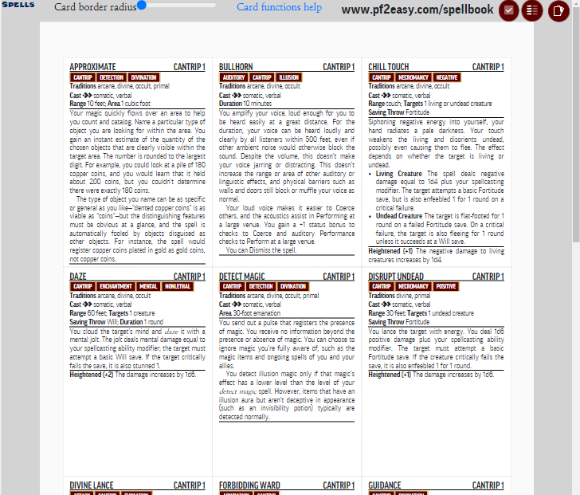
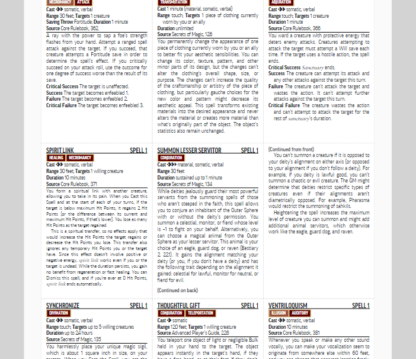
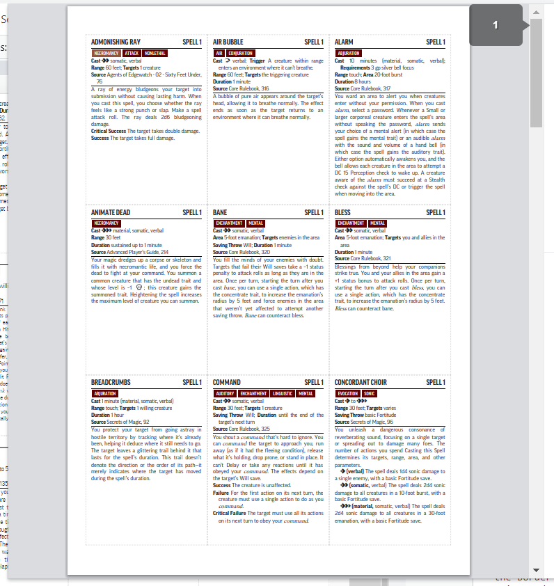

## Results
Offical Paizo cards  |  Generated Pf2 Easy cards
:-------------------------:|:-------------------------:
  |  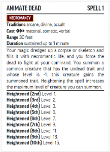
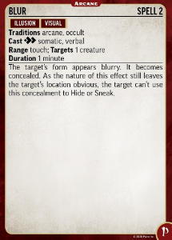  |  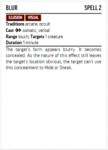
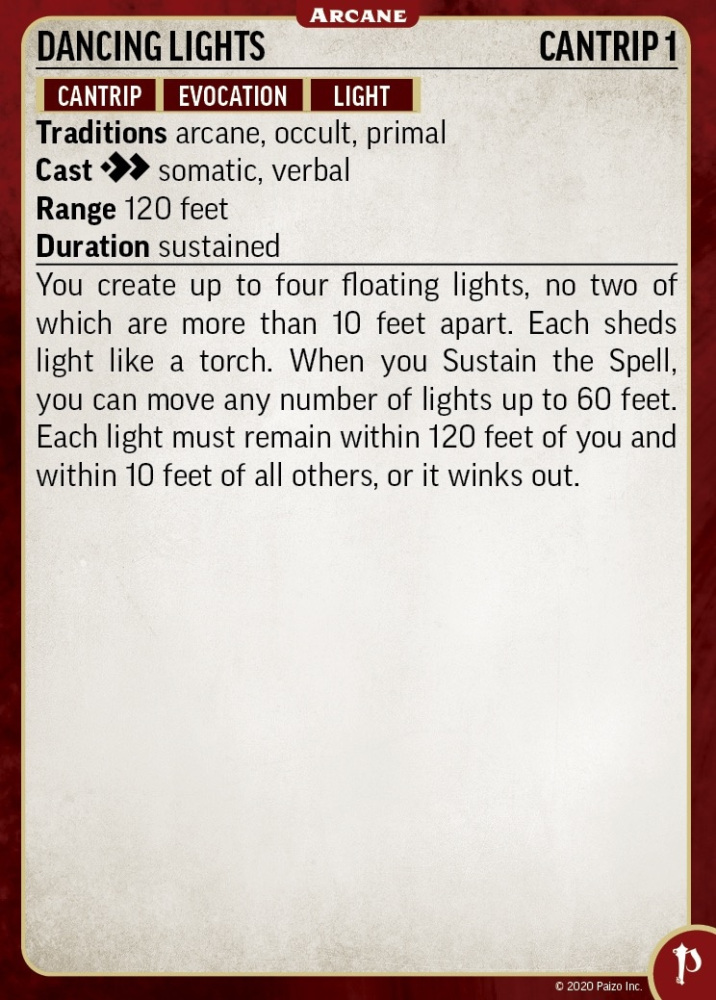  |  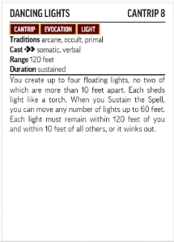
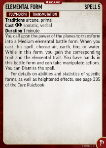  |  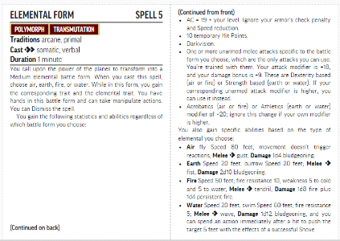
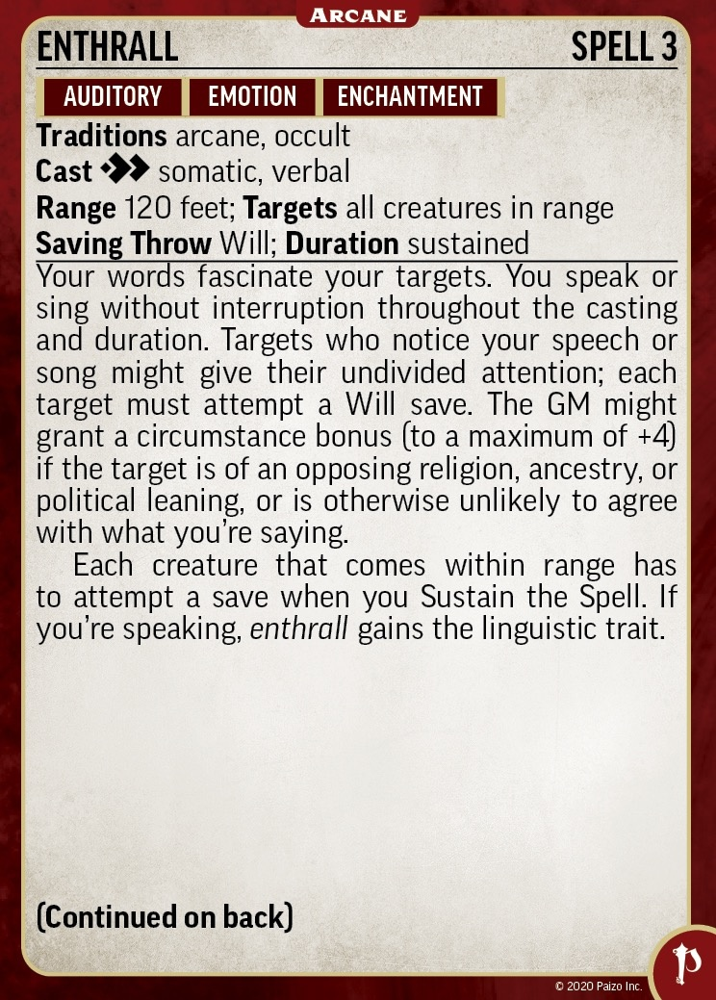  |  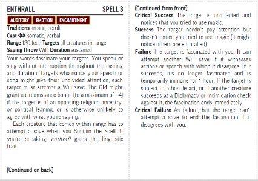
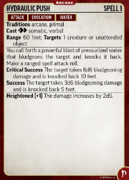  |  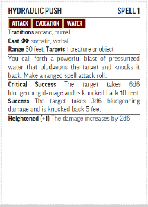
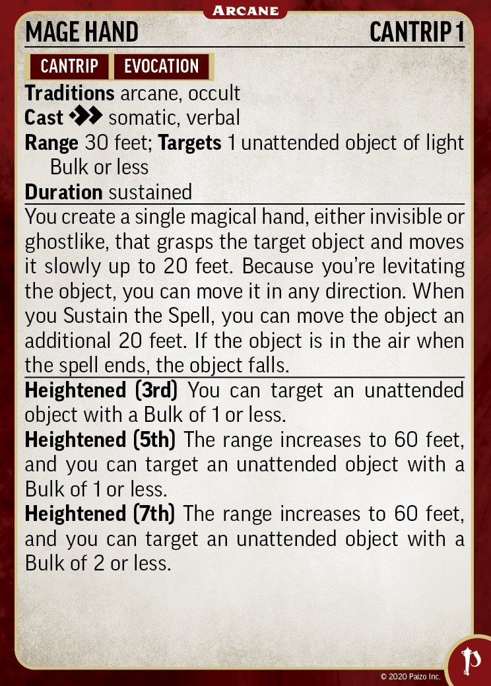  |  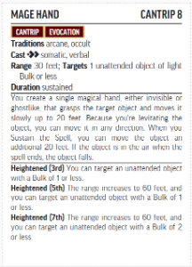
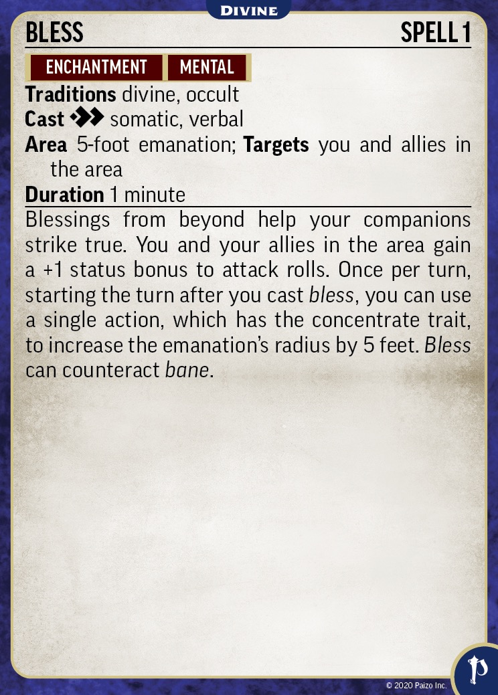  |  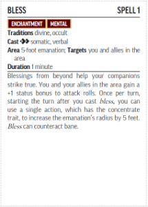
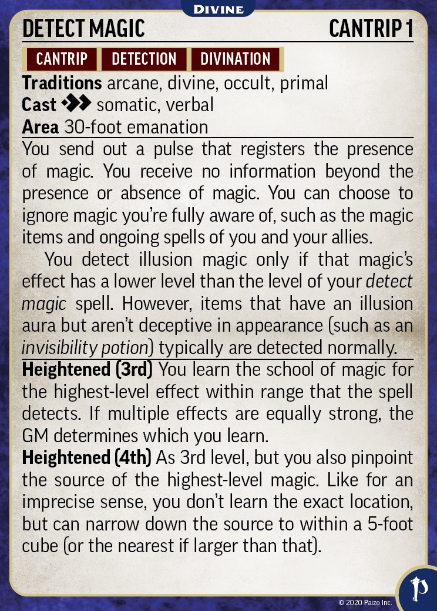  |  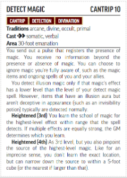
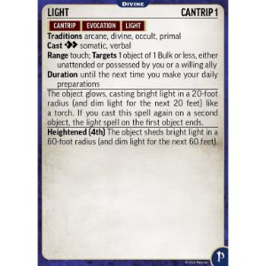  |  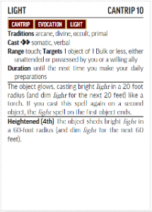
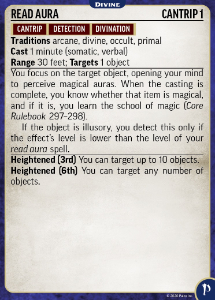  |  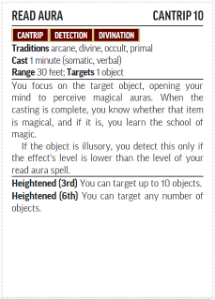
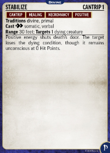  |  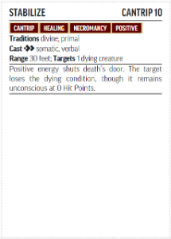
  |  
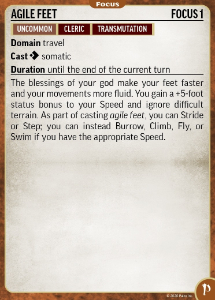  |  
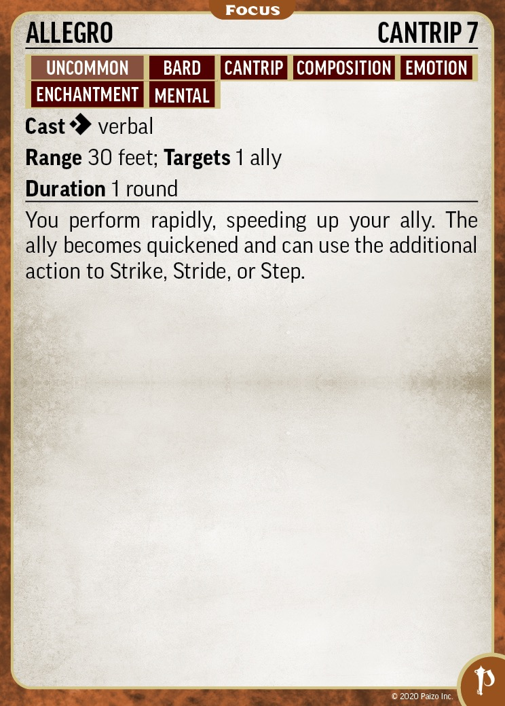  |  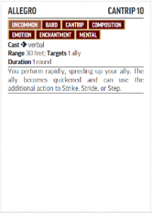
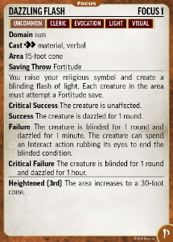  |  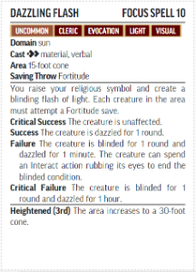
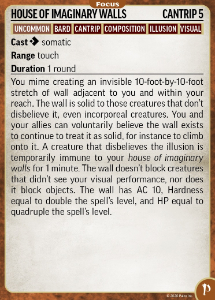  |  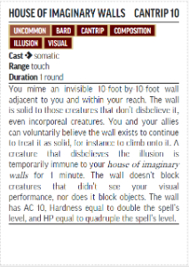
  |  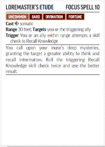
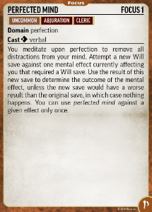  |  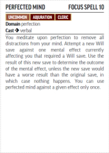
